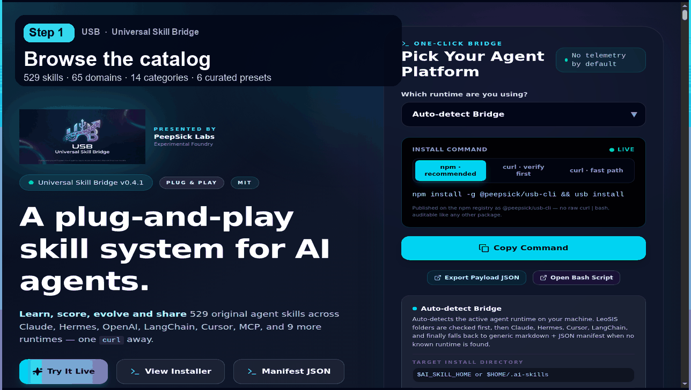

# USB — Universal Skill Bridge

<p align="center">
  
</p>

<p align="center">
  <b>npm for AI agent skills.</b><br>
  Install, share, and compose reusable capabilities across any agent runtime.
</p>

<p align="center">
  <a href="https://www.npmjs.com/package/@peepsick/usb-sdk">
    
  </a>
  <a href="https://www.npmjs.com/package/@peepsick/usb-cli">
    
  </a>
  <a href="https://github.com/PeepSick/usb/blob/main/LICENSE">
    
  </a>
  <a href="https://usb.peepsicklabs.com">
    
  </a>
  <a href="https://www.npmjs.com/package/@peepsick/usb-sdk">
    
  </a>
</p>

<p align="center">
  <sub>Build in public · Pre-revenue · 529 skills · 16 provider targets</sub>
</p>

---

## Quickstart

```bash
npm install -g @peepsick/usb-cli

usb search postgres
usb install intent-router
usb install web-dev --target=claude
```

That's it — `usb` detects your agent runtime (Claude, Cursor, LangChain, MCP, local models, ...) and drops a runtime-native skill package in the right place.

## Why USB?

Every agent runtime invents its own way to package capabilities: Claude Code has skills, Cursor has rules, LangChain has tools, MCP has servers. There's no shared unit you can install once and reuse everywhere — so the same "audit this Dockerfile" or "harden this API" logic gets rewritten from scratch for every framework.

USB is a packaging and distribution layer for that logic, the same way npm decoupled "a piece of JavaScript" from "the app that runs it":

| | Without USB | With USB |
|---|---|---|
| Distribution | Copy-paste prompts between repos | `usb install <skill>` |
| Portability | Rewritten per framework | One skill, 16 runtime targets |
| Discovery | Scattered gists and Notion docs | `usb search`, `/api/skills`, MCP tools |
| Trust | Blind `curl \| bash` | Download → verify sha256 → read → run |

## Demo

<p align="center">
  
</p>

## Installing skills

**npm (recommended)** — installs the `usb` CLI globally:

```bash
npm install -g @peepsick/usb-cli

usb install intent-router     # a single skill
usb install web-dev           # a preset bundle
usb install --target=claude   # force a specific runtime target
```

**Inspect-then-install** — no npm/Node required, verifies the script before running it:

```bash
# 1. Download
curl -fsSL https://usb.peepsicklabs.com/api/install?target=auto -o install.sh

# 2. Verify checksum (mismatches mean tampering or a stale CDN)
EXPECTED=$(curl -fsSL https://usb.peepsicklabs.com/api/install-sha256?target=auto)
echo "$EXPECTED  install.sh" | sha256sum -c -

# 3. Read what it actually does
less install.sh

# 4. Run it
bash install.sh
```

If you'd rather skip the review step and trust the publisher, the same script also runs directly via `curl -fsSL https://usb.peepsicklabs.com/api/install?target=auto | bash` — but the three-step flow above is the one we recommend.

## CLI reference

| Command | Description |
|---|---|
| `usb install [skill\|preset]` | Install a skill or preset bundle into the detected runtime |
| `usb install --dry-run` | Print the install script without executing it |
| `usb install --target=<name>` | Force a specific provider target |
| `usb search <query>` | Search the skill catalog |
| `usb list` | List all installed skills |
| `usb info <skill>` | Show details for one skill |
| `usb version` | Print CLI/catalog version and the verify command for one-shot inspect+verify+run |

Dry-run everything before it touches your machine:

```bash
usb install --dry-run                  # print the install script, do NOT execute
usb install intent-router --dry-run    # dry-run a single skill
less <(usb install --dry-run web-dev)  # dry-run a preset and pipe to less
```

## The catalog

529 skills total: 9 hand-written core orchestration skills, plus 65 engineering domains systematically expanded across 8 workflows (Audit, Plan, Build, Script, Diagnose, Harden, Explain, Tune). Every skill ships with a distinct trigger phrase, protocol prompt, input/output contract, and examples.

## MCP server

USB also speaks MCP directly, so any MCP-compatible agent can search and install skills without shelling out:

```bash
curl https://usb.peepsicklabs.com/api/mcp

curl -X POST https://usb.peepsicklabs.com/api/mcp \
  -H "Content-Type: application/json" \
  -d '{"jsonrpc":"2.0","id":1,"method":"tools/list"}'
```

Transport is HTTP JSON-RPC 2.0. Exposed tools:

| Tool | Purpose |
|---|---|
| `usb_search` | Search the skill catalog |
| `usb_get_skill` | Fetch a single skill's full definition |
| `usb_audit_skill` | Audit a skill definition for issues |
| `usb_render_install` | Render an install script for a skill/target pair |

## API

| Endpoint | Purpose |
|---|---|
| `/api/install?target=<name>` | Render the install script for a target |
| `/api/install-sha256?target=<name>` | sha256 of the above, for verification |
| `/api/skills` | Browse the skill catalog |
| `/api/version` | CLI/catalog version info |
| `/api/health` | Health check |
| `/api/mcp` | MCP server (JSON-RPC 2.0) |

## Architecture


## Supported targets

`leosis` · `auto` · `claude` · `hermes` · `openai` · `anthropic` · `langchain` · `cursor` · `mcp` · `generic` · `openrouter` · `groq` · `mistral` · `ollama` · `lm-studio` · `vllm`

`auto` detects the runtime from your environment; `generic` falls back to a plain markdown + JSON manifest for anything unrecognized.

## Local development

```bash
git clone https://github.com/PeepSick/usb.git
cd usb
docker compose up -d
```

Open <http://localhost:3000>.

Stack: Next.js 16, React 19, Tailwind v4, PostgreSQL + Drizzle ORM.

## Acknowledgements & origin

Parts of the conceptual design of portable "AI skills" were inspired by emerging agent ecosystems — MCP-style tool servers, Claude Code agent workflows, and community skill catalogs such as mcpservers.org. These helped shape the broader direction of composable AI tooling.

That said, USB is a fully independent implementation built from scratch. All architecture, skill schema, installer logic, and runtime adapters were designed and implemented independently. No prompt template, skill record, or installer script was copied or scraped from any external catalog.

## Status

**v0.4.1 (beta)** — actively evolving. APIs, skill formats, and runtime adapters may change before v1.0.

## Roadmap

- Skill marketplace
- Verified skill badges
- CI-based skill validation
- Versioned skill contracts
- Agent runtime certification layer

## PeepSick Labs

PeepSick Labs is an early-stage AI infrastructure studio building modular agent systems. We are currently pre-incorporation, operating as an independent research & development group, and we build in public.

Our ecosystem:

| Layer | Role |
|---|---|
| **USB** | Installs skills (skill layer for AI agents — this project) |
| **Foundry** | Builds agents (multi-agent orchestration & cognitive runtime) |
| **Leosis** | Powers intelligence (OpenAI-compatible LLM provider) |

> USB installs skills. Foundry builds agents. Leosis powers intelligence.
> Three independent layers, one ecosystem — each ships standalone, each composes with the others.

## Contact

**PeepSick Labs**

- Web: [usb.peepsicklabs.com](https://usb.peepsicklabs.com)
- Email: [info@peepsickai.com](mailto:info@peepsickai.com)
- GitHub: [github.com/PeepSick](https://github.com/PeepSick)

## License

MIT — free to use, modify, and redistribute, including commercially.

---

<sub>Building in public · Pre-incorporation · No legal entity formed yet · 2026</sub>
