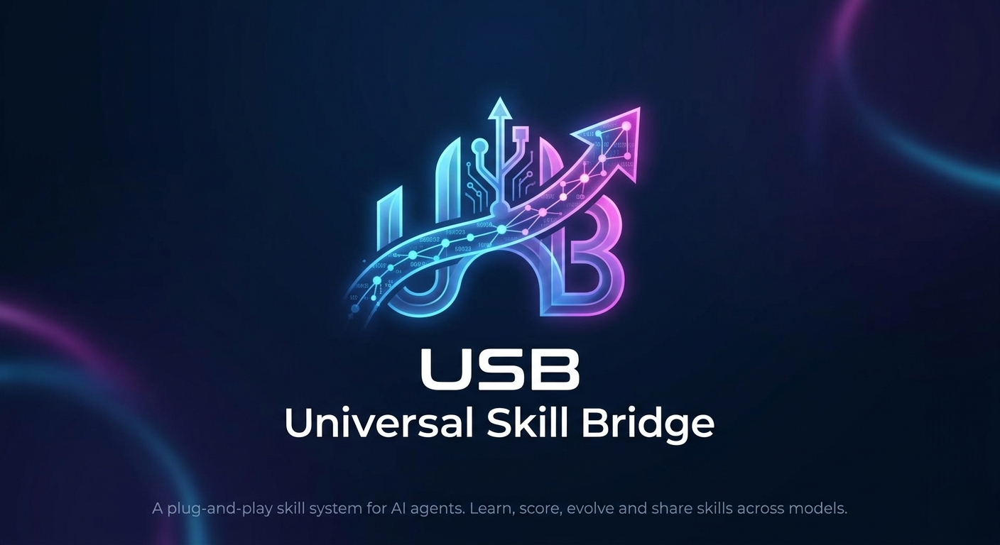
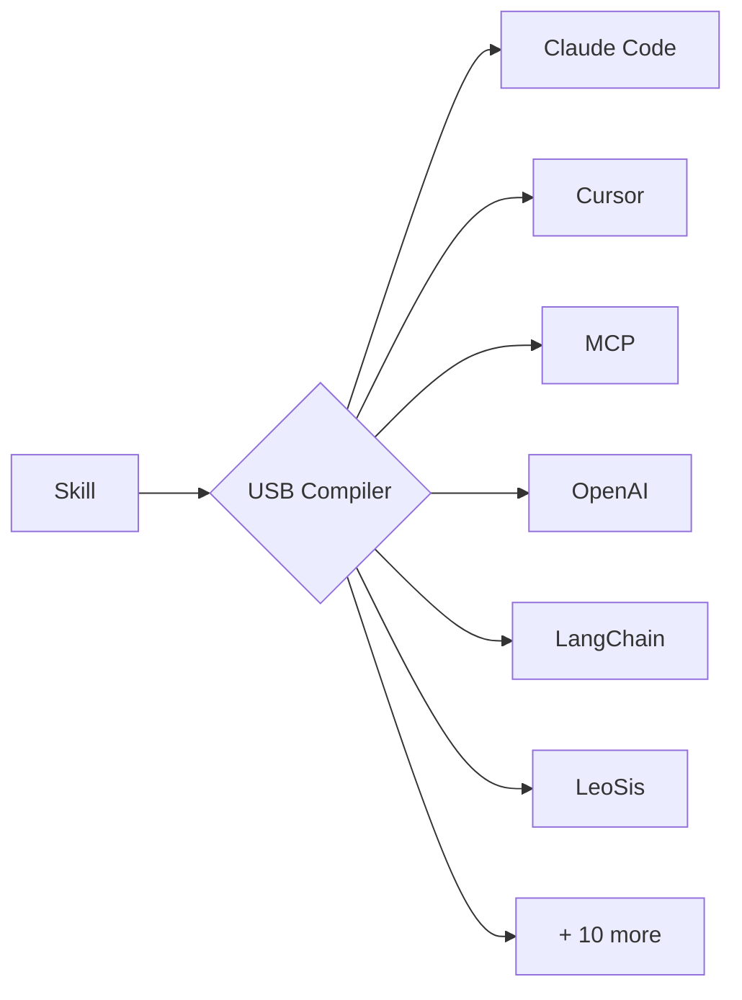

# USB — Universal Skill Bridge

<p align="center">
  
</p>

<p align="center">
  <b>One skill format. Every agent runtime.</b><br>
  Write once. Install anywhere.
</p>

<p align="center">
  <a href="https://www.npmjs.com/package/@peepsick/usb-sdk">
    
  </a>
  <a href="https://www.npmjs.com/package/@peepsick/usb-cli">
    
  </a>
  <a href="https://github.com/PeepSick/usb/blob/main/LICENSE">
    
  </a>
  <a href="https://usb.peepsicklabs.com">
    
  </a>
  <a href="https://github.com/PeepSick/usb/actions/workflows/readme-check.yml">
    
  </a>
  <a href="https://www.npmjs.com/package/@peepsick/usb-sdk">
    
  </a>
</p>

<p align="center">
  <sub>Build in public · Pre-revenue · 529 skills · 16 provider targets</sub>
</p>

---

## Quickstart

```bash
npm install -g @peepsick/usb-cli

usb search postgres
usb install intent-router
usb install web-dev --target=claude
```

`usb` detects your agent runtime — Claude Code, Cursor, MCP, LangChain, local models, and 12 more — and drops a runtime-native skill package in the right place.

<p align="center">
  
</p>

Real output, not mocked up:

```bash
$ usb install web-dev --target=claude
✅ universal-skill-bridge-catalog v0.4.2 installed for target: claude (73 skills)
📦 Portable pack: ~/.ai-skills/universal-skill-bridge-catalog
🔌 Target files: ~/.claude/skills/universal-skill-bridge-catalog
```

## Who is this for?

- ✅ **Claude Code users** — skills drop straight into `~/.claude/skills/`
- ✅ **Cursor users** — ships as a `.mdc` rule, zero extra config
- ✅ **AI teams** — one shared skill catalog instead of copy-pasted prompts across repos
- ✅ **MCP developers** — USB speaks MCP natively (`usb_search`, `usb_render_install`, ...)
- ✅ **Framework authors** — `@peepsick/usb-sdk` gives you a typed `Agent` base class to build on

## Why USB?

Every agent runtime invents its own way to package capabilities: Claude Code has skills, Cursor has rules, LangChain has tools, MCP has servers. There's no shared unit you can install once and reuse everywhere — so the same "audit this Dockerfile" or "harden this API" logic gets rewritten from scratch for every framework.

| | Without USB | With USB |
|---|---|---|
| Distribution | Copy-paste prompts between repos | `usb install <skill>` |
| Portability | Rewritten per framework | One skill, 16 runtime targets |
| Discovery | Scattered gists and Notion docs | `usb search`, `/api/skills`, MCP tools |
| Trust | Blind `curl \| bash` | Download → verify sha256 → read → run |

## Architecture

One skill definition. USB compiles it into every runtime's native format.


```mermaid
flowchart LR
    S[Skill] --> C{USB Compiler}
    C --> R1[Claude Code]
    C --> R2[Cursor]
    C --> R3[MCP]
    C --> R4[OpenAI]
    C --> R5[LangChain]
    C --> R6[LeoSis]
    C --> R7[+ 10 more]
```

You write it once. USB handles packaging, install paths, and sha256-verified delivery for all 16 targets.

## Supported targets

`leosis` · `auto` · `claude` · `hermes` · `openai` · `anthropic` · `langchain` · `cursor` · `mcp` · `generic` · `openrouter` · `groq` · `mistral` · `ollama` · `lm-studio` · `vllm`

`auto` detects the runtime from your environment; `generic` falls back to a plain markdown + JSON manifest for anything unrecognized. Catalog: 529 skills — 9 hand-written core skills plus 65 engineering domains × 8 workflows (Audit, Plan, Build, Script, Diagnose, Harden, Explain, Tune).

## Installing skills

**npm (recommended)**:

```bash
npm install -g @peepsick/usb-cli

usb install intent-router     # a single skill
usb install web-dev           # a preset bundle
usb install --target=claude   # force a specific runtime target
```

**Inspect-then-install** — no npm/Node required, verifies the script before running it:

```bash
curl -fsSL https://usb.peepsicklabs.com/api/install?target=auto -o install.sh
EXPECTED=$(curl -fsSL https://usb.peepsicklabs.com/api/install-sha256?target=auto)
echo "$EXPECTED  install.sh" | sha256sum -c -   # mismatch = tampering or a stale CDN
less install.sh                                  # read what it actually does
bash install.sh
```

Trust the publisher and skip the review step: `curl -fsSL https://usb.peepsicklabs.com/api/install?target=auto | bash`

## CLI reference

| Command | Description |
|---|---|
| `usb install [skill\|preset]` | Install a skill or preset bundle into the detected runtime |
| `usb install --dry-run` | Print the install script without executing it |
| `usb install --target=<name>` | Force a specific provider target |
| `usb search <query>` | Search the skill catalog |
| `usb list` | List all installed skills |
| `usb info <skill>` | Show details for one skill |
| `usb version` | Print CLI/catalog version and the verify command for one-shot inspect+verify+run |

```bash
usb install --dry-run                  # print the install script, do NOT execute
less <(usb install --dry-run web-dev)  # dry-run a preset and pipe to less
```

## API

| Endpoint | Purpose |
|---|---|
| `/api/install?target=<name>` | Render the install script for a target |
| `/api/install-sha256?target=<name>` | sha256 of the above, for verification |
| `/api/skills` | Browse the skill catalog |
| `/api/audit/<slug>` | Audit a single skill definition |
| `/api/version` | CLI/catalog version info |
| `/api/health` | Health check |
| `/api/mcp` | MCP server — HTTP JSON-RPC 2.0, tools: `usb_search`, `usb_get_skill`, `usb_audit_skill`, `usb_render_install` |

```bash
curl -X POST https://usb.peepsicklabs.com/api/mcp \
  -H "Content-Type: application/json" \
  -d '{"jsonrpc":"2.0","id":1,"method":"tools/list"}'
```

## Local development

```bash
git clone https://github.com/PeepSick/usb.git
cd usb
docker compose up -d
```

Open <http://localhost:3000>. Stack: Next.js 16, React 19, Tailwind v4, PostgreSQL + Drizzle ORM.

## Contributing

USB is built in public and contributions are genuinely welcome — bug reports,
docs fixes, new runtime adapters, new skill domains, or security hardening.
You don't need to write code to help. Start with
[CONTRIBUTING.md](CONTRIBUTING.md); security issues go to
[info@peepsickai.com](mailto:info@peepsickai.com) instead of the public tracker.

Before opening a PR that touches the CLI, installer, or this README, run
`bash scripts/verify-readme.sh` (README examples against the live catalog),
`python3 scripts/check-encoding.py` (full-catalog encoding scan), and
`python3 scripts/check-links.py` (broken internal links). CI runs all three
on every PR and daily on a schedule.

---

<details>
<summary>Status, roadmap, license, ecosystem</summary>

### Status

**v0.4.2 (beta)** — actively evolving. APIs, skill formats, and runtime adapters may change before v1.0.

### Roadmap

- Skill marketplace
- Verified skill badges
- CI-based skill validation (schema/lint checks for new skill submissions)
- README-driven test harness — auto-extract and run labeled code blocks from this file in CI, instead of hand-syncing `scripts/verify-readme.sh`
- Versioned skill contracts
- Agent runtime certification layer

### Acknowledgements & origin

Parts of the conceptual design of portable "AI skills" were inspired by emerging agent ecosystems — MCP-style tool servers, Claude Code agent workflows, and community skill catalogs such as mcpservers.org. That said, USB is a fully independent implementation built from scratch. No prompt template, skill record, or installer script was copied or scraped from any external catalog.

### PeepSick Labs ecosystem

PeepSick Labs is an early-stage AI infrastructure studio, currently pre-incorporation, building in public.

| Layer | Role |
|---|---|
| **USB** | Installs skills (skill layer for AI agents — this project) |
| **Foundry** | Builds agents (multi-agent orchestration & cognitive runtime) |
| **Leosis** | Powers intelligence (OpenAI-compatible LLM provider) |

### Contact

- Web: [usb.peepsicklabs.com](https://usb.peepsicklabs.com)
- Email: [info@peepsickai.com](mailto:info@peepsickai.com)
- GitHub: [github.com/PeepSick](https://github.com/PeepSick)

### License

MIT — free to use, modify, and redistribute, including commercially.

</details>

<sub>Building in public · Pre-incorporation · No legal entity formed yet · 2026</sub>
